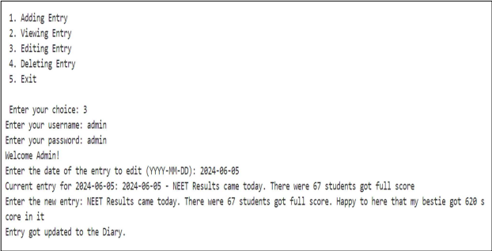
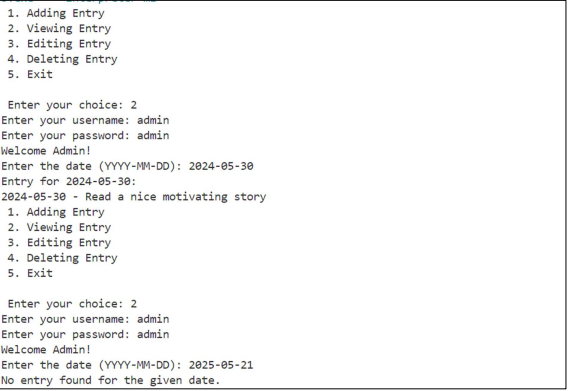
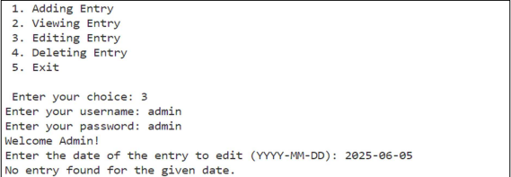
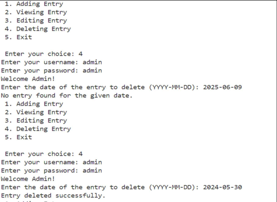
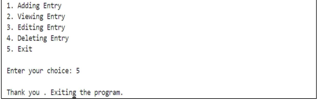

# 📔 Personal Diary Management System

The **Personal Diary Management System** is a console-based C application that lets users securely manage daily journal entries. With support for adding, viewing, editing, and deleting entries, it provides a simple but effective way to log personal thoughts. Built with standard C libraries, it's great for offline, private journaling.

---

## 🎯 Features

- **User Authentication**: Only authorized users can access the diary using a username and password.
- **Add Entries**: Create diary entries with date and content, saved to a local text file.
- **View Entries**: Retrieve entries by date with simple date-based search.
- **Edit & Delete**: Modify or remove existing entries securely.
- **Console UI**: Lightweight and runs entirely on the terminal.
- **File I/O**: All entries are stored locally using standard C file handling.

---

## 🛠️ Requirements

- C Compiler (e.g., GCC)
- Terminal or command-line environment
- Standard C libraries (`stdio.h`, `stdlib.h`, `string.h`)

---

## 🧪 How to Compile and Run

1. **Clone the repository** or copy the source file:

   ```bash
   git clone https://github.com/yourusername/diary-management-system.git
   cd diary-management-system
   ```
2. **Compile the program**:
```bash
   gcc main.c -o diary
```
3. **Run the program**:
```bash
   ./diary
```

## 🖼️ Screenshots

### 🔹 Add Entry



### 🔹 Edit Entry



### 🔹 Delete Entry


### 🔹 Exit 



